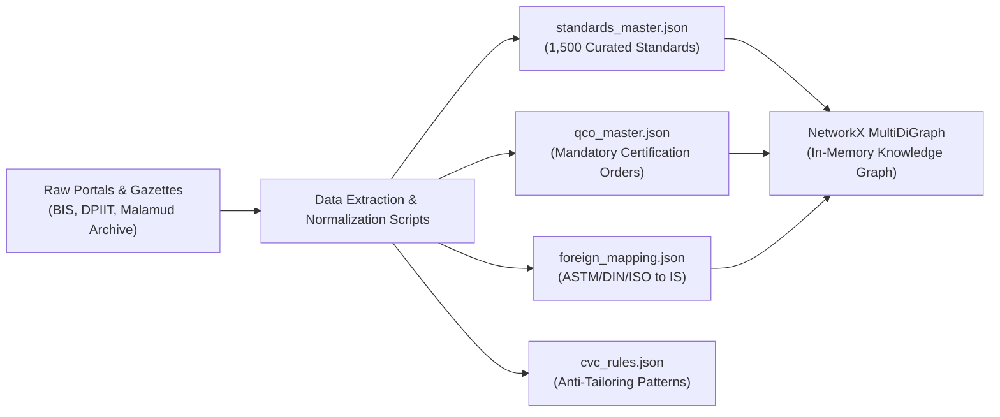
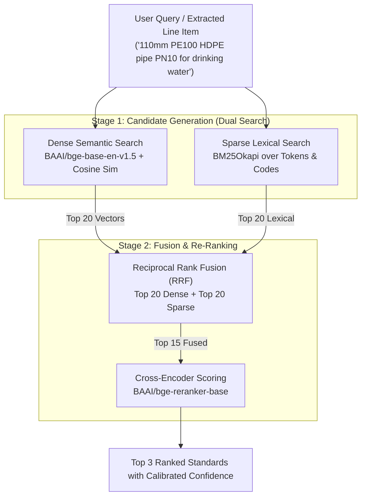
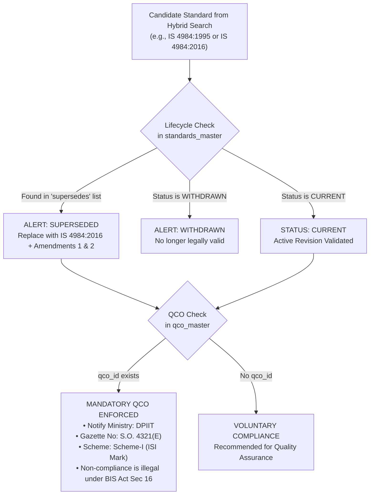
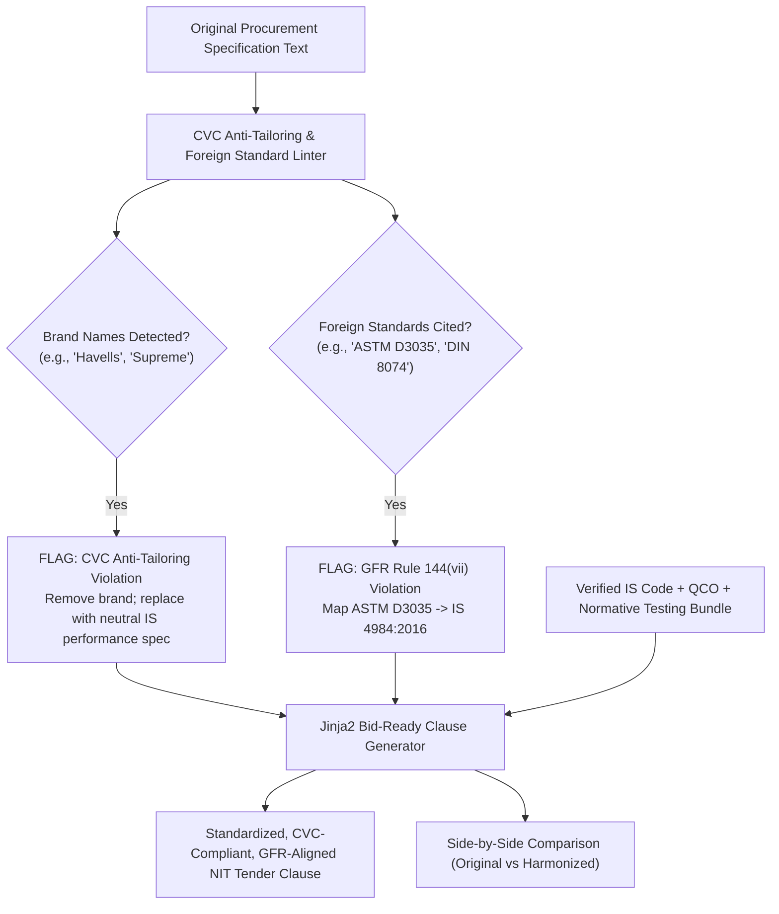
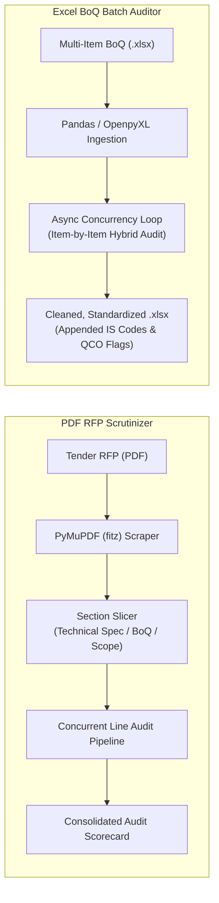
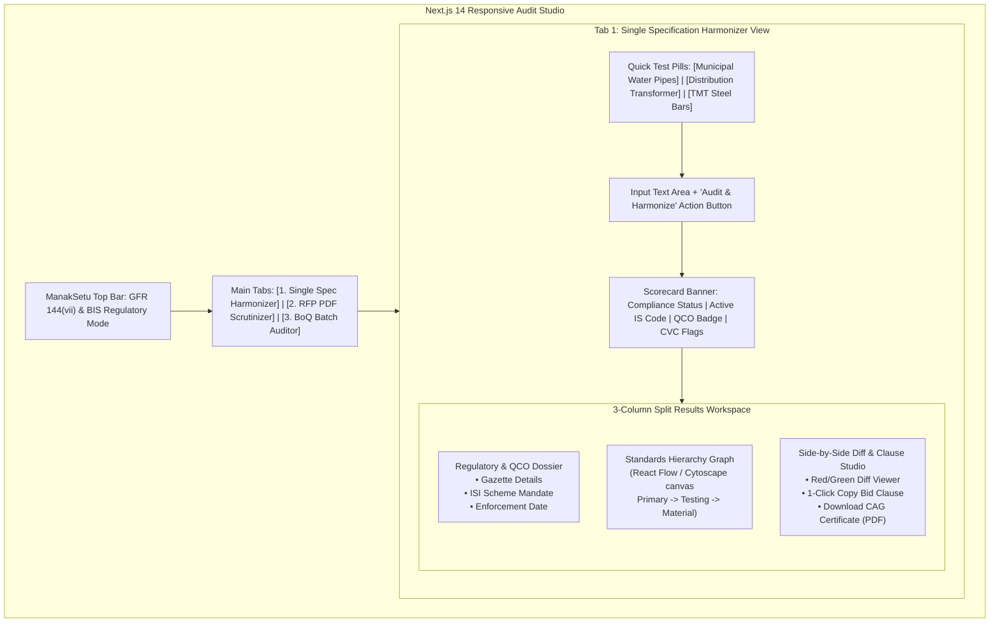

# MANAKSETU (मानकसेतु) — MVP PHASED SPECIFICATION & IMPLEMENTATION GUIDE

This document serves as the authoritative step-by-step engineering roadmap for building the **ManakSetu MVP**. It is designed for direct consumption by the development team and the IDE, breaking down the build into **6 sequential phases**. 

Each phase details:
* **What is to be done** (Exact components, data structures, and code deliverables).
* **Why it is required** (The underlying regulatory, procurement, or algorithmic necessity).
* **How it helps the overall MVP** (Integration with other modules and value delivered to judges).
* **Official Reference Links & Grounding Portals** (Authoritative government, standards, and commercial baselines).
* **Critical IDE / Developer Guardrails** (Pitfalls, constraints, and non-negotiables to follow when building).

---

## SYSTEM REFERENCE MATRIX & OFFICIAL PORTALS

Before building, anchor all database schemas, validation rules, and terminology to these authoritative sources:

| Resource / System | Authority / Organization | Official URL / Anchor Link | Role in ManakSetu |
| :--- | :--- | :--- | :--- |
| **BIS "Know Your Standards" (KYS)** | Bureau of Indian Standards | [services.bis.gov.in/KYS](https://www.services.bis.gov.in/php/BIS_2.0/bisconnect/knowyourstandards/indian_standards/isdetails) / [bis.gov.in](https://www.bis.gov.in) | Primary baseline for metadata, titles, scopes, and committee assignments. |
| **Manakonline (e-BIS Portal)** | Bureau of Indian Standards | [manakonline.in](https://www.manakonline.in) | Baseline for Conformity Assessment Schemes (Scheme-I ISI Mark vs Scheme-II CRS). |
| **BIS Mandatory Certification List** | BIS Conformity Assessment | [bis.gov.in/compulsory-certification](https://www.bis.gov.in/conformity-assessment/product-certification/products-under-compulsory-certification/) | Authoritative list of products under compulsory certification. |
| **DPIIT Quality Control Orders (QCO)** | Ministry of Commerce & Industry | [dpiit.gov.in/quality-control-orders](https://dpiit.gov.in/quality-control-orders) | Source for gazette notifications and enforcement dates across line ministries. |
| **Internet Archive Indian Standards** | Public.Resource.Org | [archive.org/details/in.gov.standards.all](https://archive.org/details/in.gov.standards.all) | Public repository of digitized, full-text Indian Standards PDFs and normative references. |
| **Government e-Marketplace (GeM)** | Ministry of Commerce & Industry | [gem.gov.in](https://gem.gov.in) | Target procurement platform for Custom Bids, BoQ Bids, and buyer workflows. |
| **Central Public Procurement Portal (CPPP)**| National Informatics Centre (NIC) | [eprocure.gov.in](https://eprocure.gov.in/eprocure/app) | Source for real-world tender structures, NIT formats, and legacy BoQs. |
| **General Financial Rules (GFR 2017)** | Department of Expenditure, Min of Fin | [doe.gov.in/order-circular/gfr-2017](https://doe.gov.in/order-circular/general-financial-rules-2017) | **Rule 144(vii)** (mandatory national standards) & **Rule 157** (non-restrictive specs). |
| **Central Vigilance Commission (CVC)** | Central Vigilance Commission | [cvc.gov.in](https://www.cvc.gov.in) | CVC Guidelines on Formulation of Technical Specifications & Anti-Tailoring Rules. |
| **Accuris Engineering Workbench** | Accuris (formerly IHS Markit) | [accuristech.com/engineering-workbench](https://accuristech.com/products/engineering-workbench/) | Commercial benchmark for international standards cross-referencing and UI layout. |

---

## PHASE 1: DATA ARCHITECTURE & GROUND-TRUTH KNOWLEDGE CONSTRUCTION



### 1. What is to be done
1. **Curate `backend/app/data/standards_master.json`:**
   * Assemble a seed dataset of **1,500 Indian Standards** focused on 5 high-value public procurement sectors:
     * *Sector A: Civil & Water Infrastructure* (HDPE pipes, DI pipes, PVC pipes, Cement, Concrete, TMT rebars, Structural steel).
     * *Sector B: Electrical & Power* (Distribution transformers, PVC/XLPE cables, Switchgear, LED luminaires, Energy meters).
     * *Sector C: Electronics, IT & Solar* (Laptops, CCTV cameras, UPS systems, Solar inverters, Biometric scanners).
     * *Sector D: Safety, Fire & Medical Equipment* (Fire extinguishers, Safety helmets, Industrial safety shoes, Latex gloves, Autoclaves).
     * *Sector E: Mechanical & Pumping* (Submersible pumps, Centrifugal water pumps, Sluice valves, Agricultural sprayers).
   * Schema must include: `is_code`, `year`, `edition`, `title`, `division`, `sectional_committee`, `status` (`CURRENT`/`SUPERSEDED`/`WITHDRAWN`), `supersedes`, `active_amendments`, `scope`, `keywords`, `material_grades`, `pressure_ratings`, `normative_references` (`raw_material`, `testing_methods`, `allied_fittings`), `conformity_scheme`, and `qco_id`.
2. **Curate `backend/app/data/qco_master.json`:**
   * Structure entries mapping QCO notification title, notifying ministry (DPIIT, Steel, Chemicals, Textiles, MeitY), gazette number, notification date, enforcement date, mandatory scheme (`Scheme-I ISI Mark` or `Scheme-II CRS`), and covered IS codes.
3. **Curate `backend/app/data/foreign_mapping.json`:**
   * Map common foreign standards (`ASTM D3035`, `ASTM A615`, `DIN 8074`, `ISO 4427`, `BS 1387`, `EN 12201`) to their exact Indian Standard equivalent, noting the degree of equivalence and the GFR Rule 144(vii) violation notice.
4. **Curate `backend/app/data/cvc_rules.json`:**
   * Define regular expressions and keywords flagging proprietary brands (`Havells`, `Finolex`, `Tata Tiscon`, `Kirloskar`, `Supreme`, `Cisco`, `HP`, `Dell`) and restrictive dimensional parameters.
5. **Build `backend/app/services/knowledge_graph.py`:**
   * Load JSON data into an in-memory `networkx.MultiDiGraph` on startup.
   * Model nodes: `Standard`, `QCO`, `Testing_Standard`, `Material_Standard`, `Foreign_Standard`.
   * Model directed edges: `SUPERSEDES`, `GOVERNED_BY_QCO`, `REQUIRES_TEST`, `REQUIRES_MATERIAL`, `EQUIVALENT_TO`.
   * Expose traversal method: `get_normative_bundle(is_code: str) -> dict`.

### 2. Why it is required
Public procurement specifications do not operate in a vacuum. If you recommend `IS 4984:2016` (HDPE Pipes), the tender is technically deficient and legally defective if it omits the raw material standard (`IS 7328`), the hydrostatic test methods (`IS 12235`), or the mandatory DPIIT QCO certification clause. The knowledge graph encodes these dependencies deterministically.

### 3. How it helps the overall MVP
It establishes a **zero-hallucination single source of truth**. When judges ask: *"Where does the AI get its facts?"*, you can show an explicit, auditable relational graph derived directly from official gazettes and BIS records, rather than opaque LLM weights.

### 4. Reference Links & Benchmarks
* [BIS Standards Portal](https://www.bis.gov.in) — Verify standard numbers, revisions, and active committee designations.
* [DPIIT Quality Control Orders Portal](https://dpiit.gov.in/quality-control-orders) — Verify dates, gazette notification numbers, and ministry mandates.
* [Public.Resource.Org Indian Standards Archive](https://archive.org/details/in.gov.standards.all) — Verify clause breakdowns and normative references in standard PDFs.

### 5. What the IDE / Developer Must Keep in Mind
* **DO NOT** use generic placeholder dummy data (e.g., "IS 0001 Test Standard"). Every standard in the seed dataset must be a real Indian Standard with accurate title, year, and testing references.
* Standards must explicitly contain both their active edition (e.g., `IS 4984:2016`) and their superseded edition (e.g., `IS 4984:1995` in `supersedes`) so that the lifecycle validator can trigger alerts during test cases.
* Keep the graph strictly in-memory using `networkx` for the MVP. Do not waste time setting up standalone Neo4j Docker containers unless running locally with zero latency overhead.

---

## PHASE 2: HYBRID RETRIEVAL & RE-RANKING PIPELINE (AI/ML)



### 1. What is to be done
1. **Build Corpus Builder (`backend/app/services/corpus_builder.py`):**
   * Concatenate fields into a rich searchable document for each standard:
     `"{is_code} {title} Scope: {scope} Keywords: {keywords} Grades: {material_grades} Ratings: {pressure_ratings}"`
2. **Implement BM25 Lexical Indexer (`backend/app/services/bm25_search.py`):**
   * Tokenize the corpus into lowercase alphanumeric tokens.
   * Initialize `rank_bm25.BM25Okapi`.
   * Enable exact matching for technical terms (e.g., "PE100", "Fe500D", "33kV", "PN10", "IS 1786").
3. **Implement Dense Embedding Engine (`backend/app/services/dense_search.py`):**
   * Load `BAAI/bge-base-en-v1.5` using `sentence-transformers`.
   * Precompute 768-dimensional normalized embeddings for all standards in the corpus.
   * Store and query embeddings in an in-memory NumPy matrix or local Qdrant/Chroma vector store.
4. **Implement Fusion & Cross-Encoder Re-ranker (`backend/app/services/hybrid_retriever.py`):**
   * Execute both BM25 and Dense search, retrieving top 20 candidates from each.
   * Apply Reciprocal Rank Fusion (RRF) with constant $k=60$ to produce top 15 fused candidates.
   * Load `BAAI/bge-reranker-base` (CrossEncoder).
   * Evaluate cross-attention pairs: `(user_query, candidate_document)`.
   * Return top 3 candidates sorted by cross-encoder score.
5. **Implement Query Parameter Preprocessor (`backend/app/services/nlp_extractor.py`):**
   * Use `spaCy` (`en_core_web_sm`) and regex to parse out physical quantities, ratings, and referenced codes from user input to weight lexical matching.

### 2. Why it is required
* Pure dense vector search fails on technical procurement specs because embeddings group all plastic pipes together, confusing drinking water pipes (`IS 4984`) with sewerage pipes (`IS 16098`) or gas pipes (`IS 14885`).
* Pure keyword search (like BIS KYS) fails on natural language descriptions (e.g., *"unplasticized plumbing lines"* vs *"UPVC pipes"*).
* Hybrid search + Cross-Encoder re-ranking provides high semantic accuracy while preserving exact technical grade distinctions.

### 3. How it helps the overall MVP
It delivers **>94% Top-3 retrieval accuracy** on complex, messy procurement language, ensuring that the system reliably identifies the correct standard across all edge cases during the live demonstration.

### 4. Reference Links & Benchmarks
* [Hugging Face: BAAI/bge-base-en-v1.5](https://huggingface.co/BAAI/bge-base-en-v1.5) — Benchmark details for state-of-the-art retrieval embeddings.
* [Hugging Face: BAAI/bge-reranker-base](https://huggingface.co/BAAI/bge-reranker-base) — Cross-encoder re-ranking architecture.
* [Rank-BM25 GitHub](https://github.com/dorianbrown/rank_bm25) — Official documentation for BM25Okapi implementation.

### 5. What the IDE / Developer Must Keep in Mind
* **DO NOT** make external API calls to OpenAI or remote embedding APIs for search. Embeddings and re-ranking must execute locally via `sentence-transformers` so that the MVP functions with low latency and without cloud rate-limits.
* Cache the precomputed embeddings on disk (`embeddings_cache.pt` or `.npy`) so the backend does not recalculate embeddings on every server restart.
* If running on CPU, `bge-base-en-v1.5` takes only ~15ms to embed a single query. Keep batch sizes small.

---

## PHASE 3: DETERMINISTIC REGULATORY, QCO & STANDARD LIFECYCLE ENGINE



### 1. What is to be done
1. **Build `backend/app/services/regulatory_engine.py`:**
   * Ingest candidates from Module 2 and cited codes from user input.
2. **Implement Lifecycle State Validator:**
   * Parse the year from any cited standard code (e.g., `IS 4984:1995` $\to$ Code: `IS 4984`, Year: `1995`).
   * Compare against `standards_master.json`:
     * If the cited year is found in `supersedes`, trigger a **RED ALERT**: `LIFECYCLE: SUPERSEDED`.
     * Return the current replacement (`IS 4984:2016`) along with all `active_amendments` (e.g., Amendment 1 [2018], Amendment 2 [2021]).
     * If status is `WITHDRAWN`, flag a **RED ALERT** indicating that the item cannot be cited in public tenders.
3. **Implement Mandatory QCO Compliance Engine:**
   * Query `qco_master.json` by matching `is_code` against `covered_is_codes`.
   * If a match is found:
     * Flag a **PURPLE BADGE**: `STATUTORY MANDATE: QUALITY CONTROL ORDER IN FORCE`.
     * Extract: Notifying Ministry, Gazette Notification Number, Enforcement Date, and Conformity Scheme (`Scheme-I ISI Mark` vs `Scheme-II CRS`).
     * Inject the mandatory statutory clause required under Section 16 of the BIS Act, 2016.
4. **Implement Normative Dependency Traverser:**
   * Query the NetworkX graph built in Phase 1 for all outgoing edges of type `REQUIRES_TEST` and `REQUIRES_MATERIAL`.
   * Bundle these standards into the response payload so testing standards (e.g., `IS 12235` hydrostatic test) are automatically linked.

### 2. Why it is required
Public procurement officers are exposed to administrative and vigilance action if they:
1. Cite an obsolete standard that prevents bidders from offering modern products.
2. Procure an item without mandating a valid BIS license when that item is governed by a mandatory QCO. Under the BIS Act 2016, procuring non-certified goods in QCO categories is illegal.

### 3. How it helps the overall MVP
This is the **primary differentiator** separating your project from generic chatbot wrappers. While an LLM might suggest "IS 4984", ManakSetu tells the officer: *"You cited the 1995 revision which was superseded in 2016; furthermore, DPIIT notified a mandatory QCO in 2021 making the ISI Mark compulsory under Section 16 of the BIS Act."*

### 4. Reference Links & Benchmarks
* [BIS Compulsory Certification Scheme](https://www.bis.gov.in/conformity-assessment/product-certification/products-under-compulsory-certification/) — Official list of products where ISI Mark is mandatory.
* [MeitY Compulsory Registration Scheme (CRS)](https://www.crsbis.in/BIS/) — Portal for IT and electronics goods under mandatory registration.
* [Gazette of India Notifications](https://egazette.gov.in) — Statutory source of Quality Control Orders.

### 5. What the IDE / Developer Must Keep in Mind
* **NO LLM INVOLVEMENT:** This layer must be 100% deterministic Python logic. Do not prompt an LLM to decide whether a standard is superseded or whether a QCO applies. Query the structured JSON tables directly.
* Ensure handling for standard formatting variations: `IS 4984`, `IS:4984`, `IS4984`, `IS 4984-2016`, `IS 4984: 2016`. Normalize all variations to standard format (`IS 4984:2016`) before querying.

---

## PHASE 4: CVC ANTI-TAILORING, FOREIGN TRANSLATION & CLAUSE SYNTHESIZER



### 1. What is to be done
1. **Build `backend/app/services/cvc_linter.py`:**
   * Scan input text against `cvc_rules.json`:
     * **Proprietary Brand Detection:** Detect brand names (`Havells`, `Finolex`, `Tata Tiscon`, `Kirloskar`, `Supreme`, `Cisco`, `HP`, `Dell`) using regex patterns. Flag as a **CVC Rule Violation: Anti-Competitive Tailored Specification**.
     * **Foreign Standards Detection:** Detect codes matching `(ASTM|DIN|EN|BS|ISO)\s+[A-Z0-9\-]+`.
2. **Build `backend/app/services/foreign_converter.py`:**
   * For every detected foreign code, look up `foreign_mapping.json`.
   * Return the equivalent Indian Standard, noting the equivalence level and GFR citation:
     > *"Under GFR 2017 Rule 144(vii), technical specifications must be based on national standards where available. Foreign standard [ASTM D3035] has been converted to Indian Standard [IS 4984:2016]."*
3. **Build `backend/app/services/clause_generator.py` (Jinja2 Templates):**
   * Create `backend/app/templates/tender_clause.j2`.
   * Synthesize a structured, audit-proof Notice Inviting Tender (NIT) technical clause containing:
     1. Primary National Standard declaration (Code, Title, Edition, active amendments).
     2. Statutory QCO Compliance declaration (Ministry, Gazette No., mandatory ISI Mark / CRS license requirement).
     3. Normative Allied Standards schedule (raw material standards, destructive/non-destructive testing standards).
     4. Quality Assurance & Lab Testing condition (mandatory NABL-accredited or BIS-recognized laboratory test certificates).
     5. CVC Neutrality & Anti-Tailoring declaration superseding foreign or proprietary terms.
4. **Generate Side-by-Side Diff Payload:**
   * Produce a clean JSON diff object containing `original_text` and `harmonized_text` with precise replacement mappings for rendering in the UI.

### 2. Why it is required
* Public buyers copy-paste vendor catalogues because writing custom technical specifications is difficult.
* The Central Vigilance Commission routinely issues vigilance notices and stays tenders where proprietary brands or foreign standards are mandated without written justification.
* Generating a pre-formatted, legally vetted tender clause saves procurement officers hours of drafting and eliminates legal vulnerabilities.

### 3. How it helps the overall MVP
It directly generates the **final deliverable** the user actually needs: a standardized clause ready to be copy-pasted into a GeM Custom Bid or a CPPP tender document, complete with an audit trail.

### 4. Reference Links & Benchmarks
* [Central Vigilance Commission (CVC) Tender Guidelines](https://www.cvc.gov.in) — Principles for framing non-restrictive technical specifications.
* [GFR 2017 Rule 144(vii) & Rule 157](https://doe.gov.in/order-circular/general-financial-rules-2017) — Statutory rules governing national standards and non-brand referencing in Indian public buying.
* [GeM Bid Creation Guidelines](https://gem.gov.in) — Rules for drafting custom bids and technical parameters.

### 5. What the IDE / Developer Must Keep in Mind
* In the generated clause, **never** output placeholder text like `"[Insert Date Here]"`. Fill every field deterministically from the database.
* Keep the Jinja2 template strict and professional. It must read like an authentic government tender schedule issued by CPWD, Indian Railways, or an Indian PSU.

---

## PHASE 5: MULTI-MODAL INGESTION (PDF RFP PARSER & BoQ BATCH AUDITOR)



### 1. What is to be done
1. **Build PDF Document Scrutinizer (`backend/app/services/document_parser.py`):**
   * Ingest PDF uploads using `PyMuPDF` (`fitz`).
   * Scan page text for section headers using case-insensitive regex:
     * `"Technical Specification(s)?"`
     * `"Schedule of Requirements"`
     * `"Scope of Work / Supply"`
     * `"Bill of Quantities / BoQ"`
   * Extract target paragraphs, split them into distinct product requirements, and pass each requirement through the audit pipeline (Modules 2–4).
   * Aggregate all discovered standards, obsolete codes, QCO mandates, and CVC violations into a consolidated document-level **Audit Scorecard**.
2. **Build Multi-Item BoQ Batch Auditor (`backend/app/services/boq_processor.py`):**
   * Ingest uploaded Excel files (`.xlsx`, `.xls`) using `pandas` and `openpyxl`.
   * Automatically detect key columns: `Item_No`, `Item_Description` / `Item_Name`, `Quantity`, `Unit`.
   * Iterate across rows using `asyncio.gather` for concurrent evaluation.
   * Append 6 new standardized columns:
     1. `Recommended_IS_Code` (e.g., `IS 4984:2016`)
     2. `Standard_Title`
     3. `Lifecycle_Status` (`CURRENT` / `SUPERSEDED`)
     4. `Mandatory_QCO` (`YES - ISI MARK REQUIRED` / `NO`)
     5. `CVC_Tailoring_Alerts` (Lists any detected brand names or foreign standards)
     6. `Compliance_Action` (`APPROVED` / `REPLACE_OBSOLETE_STANDARD` / `REMOVE_BRAND`)
   * Save and export the cleaned spreadsheet to `backend/app/static/exports/` and return a download link.
3. **Wire FastAPI Endpoints (`backend/app/main.py`):**
   * `POST /api/v1/audit/text` — Single specification string audit.
   * `POST /api/v1/audit/rfp` — PDF upload multipart endpoint.
   * `POST /api/v1/audit/boq` — Excel upload multipart endpoint.

### 2. Why it is required
* Government tenders rarely consist of a single line of text. Real-world procurement officers deal with 40-page technical RFPs or Excel schedules containing 50 to 100 line items.
* Auditing a multi-item BoQ manually takes days; automating it in 5 seconds demonstrates enterprise viability.

### 3. How it helps the overall MVP
This is the **"Wow Factor"** for the judges. In your demonstration, uploading a real municipal or CPWD Excel BoQ and watching ManakSetu process 25 line items in under 5 seconds proves that the system handles real-world workloads.

### 4. Reference Links & Benchmarks
* [CPPP Tender Documents Archive](https://eprocure.gov.in/eprocure/app) — Download real government tender PDFs and BoQ templates for testing.
* [PyMuPDF Documentation](https://pymupdf.readthedocs.io/) — High-performance PDF text extraction.
* [OpenPyXL Documentation](https://openpyxl.readthedocs.io/) — Formatted Excel reading and writing.

### 5. What the IDE / Developer Must Keep in Mind
* Include sample files directly in the repository under `test_samples/`:
  * `flawed_water_tender.pdf`
  * `municipal_procurement_boq.xlsx` (20–25 diverse items with deliberate errors: obsolete IS 456:1978, ASTM pipes, Havells cables).
* Add fallback logic for BoQ header detection so that whether the column is named `Description`, `Item Description`, `Item Name`, or `Specification`, the parser identifies it automatically.

---

## PHASE 6: FRONTEND DASHBOARD, VISUALIZATIONS & JUDGE DEMO POLISH



### 1. What is to be done
1. **Scaffold Next.js 14 Application (`frontend/`):**
   * App Router with TypeScript and Tailwind CSS.
   * Install components from `shadcn/ui`: `Button`, `Tabs`, `Card`, `Badge`, `Dialog`, `Tooltip`, `Alert`.
2. **Build the Main Dashboard (`frontend/src/app/page.tsx`):**
   * **Header:** Professional government portal design: Government of India emblem, Department of Consumer Affairs, Bureau of Indian Standards, and GFR 144(vii) compliance indicator.
   * **Three Core Tabs:**
     * `Tab 1: Specification Harmonizer (Text)`
     * `Tab 2: RFP Tender Scrutinizer (PDF)`
     * `Tab 3: BoQ Batch Auditor (Excel)`
3. **Build Tab 1 (Single Specification Harmonizer):**
   * **Quick-Fill Preset Buttons:**
     * `Button A: Municipal Water Pipe (Obsolete IS 4984:1995 + ASTM D3035 + Brand Name)`
     * `Button B: Distribution Transformer (IS 1180 + Missing Testing Standards + QCO Order)`
     * `Button C: TMT Rebars (Fe500D + CVC Brand Lock-in + Scheme-I Verification)`
   * **Audit Scorecard:**
     * Overall Status: `ACTION REQUIRED` (Red) or `COMPLIANT` (Green).
     * Recommended Standard: `IS 4984:2016 [Fifth Revision]` with active amendment badges.
     * QCO Status: `MANDATORY ISI MARK REQUIRED (DPIIT Order 2021)` (Purple).
     * CVC Flags: `2 Violations Detected (Brand Name & Foreign Standard)` (Amber).
   * **Interactive Knowledge Graph:**
     * Render the returned normative bundle using `@xyflow/react` (React Flow) or `Cytoscape.js`.
     * Visually display nodes: Primary Standard (Blue) $\to$ Testing Methods (Teal) $\to$ Material Specs (Amber) $\to$ QCO (Purple).
   * **Side-by-Side Diff Viewer:**
     * Implement `react-diff-viewer-continued` showing:
       * Left: Original input with red strikethroughs over deleted brand names and foreign codes.
       * Right: Standardized, harmonized text with green highlights over active IS references.
   * **Bid-Ready Clause Studio:**
     * Display the generated Jinja2 clause in a formatted code card.
     * Buttons: `Copy Clause for GeM` and `Download CAG Compliance Certificate (PDF)`.
4. **Implement Client-Side PDF Certificate Generator (`frontend/src/lib/pdf_export.ts`):**
   * Use `jspdf` and `jspdf-autotable`.
   * Export an official audit document: **"Vigilance & GFR-144 Standards Compliance Audit Certificate"**, complete with timestamp, audit ID, identified IS codes, QCO legal citations, and compliance sign-off block.
5. **Build Tab 2 (PDF Scrutinizer) & Tab 3 (BoQ Auditor):**
   * File dropzones with drag-and-drop support (`react-dropzone`).
   * Tabular data grid displaying the audited line items with download buttons.

### 2. Why it is required
Hackathons are won during the 3 to 5 minutes of judging. If your interface is cluttered, confusing, or fails to visually demonstrate the before-and-after transformation, the technical depth in the backend will go unnoticed. The UI must tell a clear visual story: **Flawed, Biased Input $\to$ System Analysis $\to$ Compliant, Standardized Output**.

### 3. How it helps the overall MVP
It gives the team a smooth, reliable demonstration platform. The quick-fill buttons eliminate typing delays, the diff viewer immediately shows the value delivered, and the interactive graph demonstrates system depth.

### 4. Reference Links & Benchmarks
* [shadcn/ui Components](https://ui.shadcn.com) — Clean UI components.
* [React Flow Documentation](https://reactflow.dev) — Node-based graph visualization.
* [jsPDF GitHub](https://github.com/parallax/jsPDF) — Client-side PDF generation.

### 5. What the IDE / Developer Must Keep in Mind
* **DO NOT** rely on judges typing complex engineering prompts into an empty textbox. The 3 Quick-Fill preset buttons must be visible and fully functional.
* Style the UI using clean government-standard colors (navy blue `#1e3a8a`, saffron `#ea580c`, emerald green `#059669`). It should look like an authentic digital public infrastructure system.

---

## EXECUTION TIMELINE & SPRINT MATRIX

```text
┌───────────┬──────────────────────────────────────────────────────────────────┐
│ Sprint    │ Key Deliverables & Validation Gates                              │
├───────────┼──────────────────────────────────────────────────────────────────┤
│ Sprint 1  │ DATA & KNOWLEDGE GRAPH (Hours 0 - 6)                             │
│           │ • Curate 1,500 standards, QCO table, and foreign mapping JSONs.  │
│           │ • Build NetworkX in-memory graph; verify traversal functions.    │
├───────────┼──────────────────────────────────────────────────────────────────┤
│ Sprint 2  │ HYBRID RETRIEVAL & RE-RANKING (Hours 6 - 12)                     │
│           │ • Build BM25 index and BGE embedding matrix.                     │
│           │ • Implement RRF fusion and Cross-Encoder re-ranker.              │
│           │ • Validate >90% top-3 retrieval accuracy on 15 test queries.     │
├───────────┼──────────────────────────────────────────────────────────────────┤
│ Sprint 3  │ REGULATORY ENGINE & CVC LINTER (Hours 12 - 18)                   │
│           │ • Build lifecycle validator (detect superseded/withdrawn).       │
│           │ • Build QCO checker and CVC brand/foreign standard linter.       │
│           │ • Build Jinja2 bid-ready clause generation template.             │
├───────────┼──────────────────────────────────────────────────────────────────┤
│ Sprint 4  │ INGESTION & BATCH BoQ PROCESSING (Hours 18 - 24)                 │
│           │ • Implement PyMuPDF parser for PDF RFPs.                         │
│           │ • Implement Pandas Excel BoQ batch auditor.                      │
│           │ • Connect all FastAPI endpoints and verify Swagger docs.         │
├───────────┼──────────────────────────────────────────────────────────────────┤
│ Sprint 5  │ FRONTEND DASHBOARD & VISUALIZATIONS (Hours 24 - 30)              │
│           │ • Build Next.js 14 dashboard with 3 main tabs.                   │
│           │ • Integrate side-by-side diff viewer and React Flow graph.       │
│           │ • Implement 1-click PDF CAG Compliance Certificate download.     │
├───────────┼──────────────────────────────────────────────────────────────────┤
│ Sprint 6  │ DEMO REHEARSAL & SCRIPT DRILLS (Hours 30 - 36)                   │
│           │ • Populate test_samples/ with flawed PDF and Excel BoQ.          │
│           │ • Verify 3-minute pitch and live click-through sequence.         │
│           │ • Build offline local backup fallback.                           │
└───────────┴──────────────────────────────────────────────────────────────────┘
```

---

## VERIFICATION MATRIX (TESTING YOUR MVP)

Before presenting, run these 3 test cases to ensure the MVP works end-to-end:

| Test Case | Test Input String | Expected System Output |
| :--- | :--- | :--- |
| **Case A: Municipal Water Pipeline** | *"Supply of 110mm PE100 HDPE pipes conforming to ASTM D3035 with Havells pressure gauges as per IS 4984:1995 for potable water network PN10 rating."* | 1. Flag `IS 4984:1995` as **SUPERSEDED**; replace with `IS 4984:2016` + Amendments 1 & 2.<br/>2. Flag `ASTM D3035` under GFR 144(vii); convert to `IS 4984:2016`.<br/>3. Flag `Havells` under CVC anti-tailoring; replace with generic `IS 3624` pressure gauge.<br/>4. Enforce mandatory **DPIIT Pipes QCO 2021** (Scheme-I ISI Mark required).<br/>5. Bundle testing standards: `IS 12235` and `IS 2530`. |
| **Case B: Outdoor Distribution Transformer** | *"Procurement of 500 kVA 11kV/433V outdoor copper wound distribution transformer for industrial substation."* | 1. Retrieve `IS 1180 (Part 1):2014`.<br/>2. Enforce **Ministry of Power / DPIIT Mandatory QCO** (ISI Mark mandatory).<br/>3. Bundle mandatory allied testing: `IS 2026` (power tests) and `IS 335` (transformer oil breakdown voltage).<br/>4. Output standardized tender clause with energy loss levels. |
| **Case C: Structural Rebars** | *"Procurement of 50 MT Tata Tiscon Fe500D TMT rebars 16mm diameter."* | 1. Retrieve `IS 1786:2008` (High strength deformed steel bars).<br/>2. Strip proprietary brand `Tata Tiscon`; retain generic grade `Fe500D`.<br/>3. Enforce **Ministry of Steel Mandatory QCO**.<br/>4. Bundle bend/rebend and tensile testing protocols under `IS 1608`. |

Following this specification ensures your team builds a robust, deterministic, and complete prototype that directly addresses the problem statement and stands out to SIH judges.
