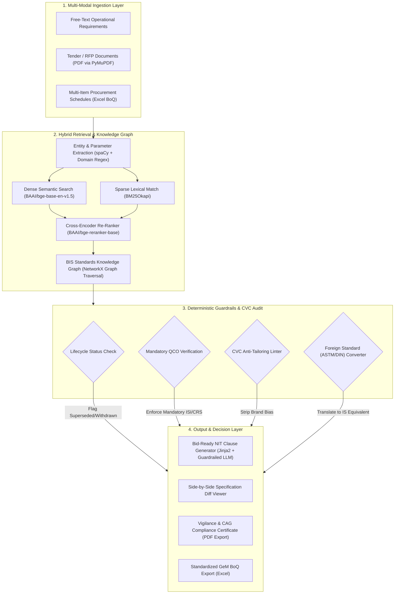
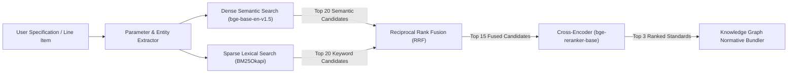
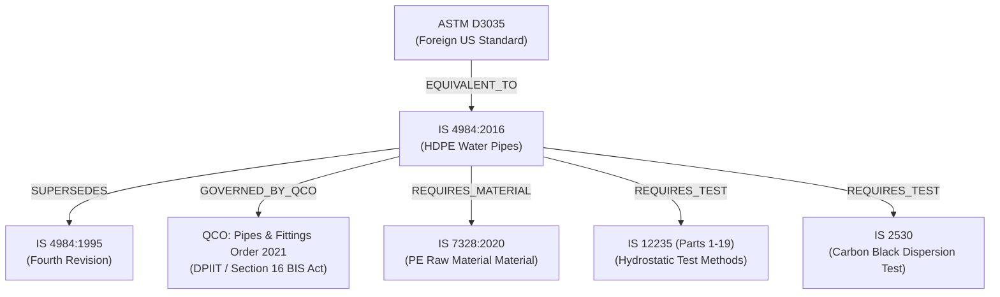

# Product Requirements Document (PRD)

## Project Name: ManakSetu (मानकसेतु)
### Intelligent Standards Harmonization & Procurement Compliance Engine for Indian Public Procurement
* **Problem Statement ID:** SIH26108
* **Ministry / Department:** Ministry of Consumer Affairs, Food and Public Distribution (Bureau of Indian Standards — BIS)
* **Theme:** Smart Automation
* **Document Version:** 1.0.0 (Production / MVP Specification)
* **Status:** Approved for Implementation

---

## 1. EXECUTIVE SUMMARY & PRODUCT VISION

### 1.1 Problem Statement
Government departments, Public Sector Undertakings (PSUs), defence agencies, healthcare directorates, and municipal corporations in India procure goods and services worth over ₹4 Lakh Crore annually through the Government e-Marketplace (GeM) and Central Public Procurement Portal (CPPP). Under **Rule 144(vii) of General Financial Rules (GFR) 2017** and **Central Vigilance Commission (CVC) guidelines**, all technical specifications must be based on national technical standards—specifically **Indian Standards (IS)** formulated by the **Bureau of Indian Standards (BIS)**—wherever available.

Furthermore, under **Section 16 of the BIS Act, 2016**, the central government has notified **over 679 product categories under mandatory Quality Control Orders (QCOs)**, making the manufacturing, import, sale, or public procurement of non-BIS certified goods a criminal regulatory offense.

Despite this legal framework:
1. Public procurement officers are domain generalists who cannot navigate **23,000+ active Indian Standards** across 15 Division Councils and hundreds of Sectional Committees.
2. Tenders frequently cite **superseded, revised, or withdrawn standards** due to decades of copy-pasting legacy tender documents.
3. Tenders frequently specify **foreign standards (ASTM, DIN, EN, ISO)** or **vendor-tailored proprietary brand features**, unfairly excluding domestic MSMEs and violating CVC anti-tailoring rules.
4. Crucial **normative testing standards** (raw materials, destructive testing, safety limits, acceptance criteria) are routinely omitted from tender schedules.
5. Existing government search tools (BIS "Know Your Standards", e-BIS Manakonline) rely strictly on exact-keyword matching on standard titles and cannot parse unstructured procurement language, complex specifications, or multi-item Bills of Quantities (BoQs).

### 1.2 The ManakSetu Solution
**ManakSetu** is an intelligent, zero-hallucination compliance and recommendation platform. It bridges unstructured procurement specifications and the formal BIS regulatory ontology. 

The system accepts free-text operational requirements, tender RFP PDFs, or multi-item Excel BoQs. It maps requirements to verified Indian Standards using a **Hybrid Semantic-Lexical Engine (BM25 + Dense Embeddings + Cross-Encoder Re-ranker)**, links normative and testing dependencies via an **in-memory BIS Knowledge Graph**, enforces statutory obligations via a **Deterministic QCO & Lifecycle Validator**, strips out vendor bias via a **CVC Anti-Tailoring Linter**, and generates **standardized, audit-proof, bid-ready tender clauses**.



---

## 2. SYSTEM PERSONAS & TARGET USERS

| Persona | Role | Key Job-to-be-Done | Core System Need |
| :--- | :--- | :--- | :--- |
| **GeM / CPPP Procurement Officer** | Municipal, State, or Central Ministry Buyer | Draft technical specifications for goods and works contracts without violating procurement law. | Automated discovery of current IS codes, normative testing clauses, and exportable bid text. |
| **Tender Scrutiny Committee Member** | Technical Evaluator / Finance Reviewer | Audit draft tenders before publication to ensure compliance with GFR 144(vii) and QCO mandates. | 1-click audit of uploaded PDF tenders with visual red/yellow compliance flags. |
| **Vigilance Officer / CAG Auditor** | CVC Inspector / Comptroller & Auditor General | Inspect awarded contracts for anti-competitive vendor bias or uncertified procurement. | Immutable Compliance Certificate detailing GFR compliance and anti-tailoring verification. |
| **Domestic MSME / Certified Bidder** | Supplier with valid BIS License | Bid on public tenders without being locked out by proprietary or foreign standard specifications. | Fair competition through standard-harmonized, brand-neutral specifications. |

---

## 3. FUNCTIONAL MODULE SPECIFICATIONS

### MODULE 1: Ingestion & Document Parser
* **Input Types Supported:**
  * Free-form natural language text (e.g., *"Supply of 110mm OD PE100 HDPE pipes for drinking water pipeline PN10 rating with electrofusion fittings"*).
  * Digital or scanned Tender/RFP PDF files (up to 50 pages).
  * Multi-item procurement schedules in `.xlsx` / `.xls` / `.csv` format (with columns: `Item_No`, `Item_Description`, `Quantity`, `Unit`).
* **Processing Mechanics:**
  * **PDF Extraction:** Extracts text and structural sections using `PyMuPDF` (`fitz`). Implements regex heuristics to locate specific sections: *"Technical Specifications"*, *"Scope of Work"*, *"Schedule of Requirements"*, and *"Bill of Quantities"*.
  * **BoQ Parsing:** `pandas` and `openpyxl` extract tabular rows while preserving line-item numbering and metadata.
  * **Entity & Technical Parameter Extraction:** Uses `spaCy` (`en_core_web_sm`) supplemented by custom regular expressions to extract:
    * Physical dimensions ($mm, cm, m, inches$).
    * Pressure/Operating ratings ($PN, bar, kg/cm^2, kVA, kV, MVA, Watts$).
    * Material grades ($PE100, Fe500D, Grade 33, SS304$).
    * Referenced numbers, legacy codes, and foreign standards ($IS, ASTM, DIN, ISO, BS$).

---

### MODULE 2: Hybrid Retrieval & Re-Ranking Engine
To guarantee zero-hallucination recommendation without relying on ungrounded LLMs, the system utilizes a multi-stage retrieval architecture:



* **Stage 1 (Sparse Retrieval):** `rank-bm25` indexes titles, keywords, scopes, and designated grades of all curated standards. Captures exact technical designations (e.g., "PE100", "PN10", "IS 4984") that pure vector cosine similarity often misses.
* **Stage 2 (Dense Retrieval):** `BAAI/bge-base-en-v1.5` (768-dimensional embeddings) maps natural language descriptions into semantic vector space. Indexed in `Qdrant` / `ChromaDB`.
* **Stage 3 (Reciprocal Rank Fusion - RRF):** Fuses sparse and dense ranks deterministically:
  $$\text{RRF Score}(d) = \frac{1}{60 + \text{Rank}_{\text{dense}}(d)} + \frac{1}{60 + \text{Rank}_{\text{sparse}}(d)}$$
* **Stage 4 (Cross-Encoder Re-Ranking):** Passes the top 15 fused candidate pairs $(\text{Query}, \text{Standard Scope})$ through `BAAI/bge-reranker-base` to produce a finalized, calibrated confidence score ($0.0 \text{ to } 1.0$) for the top 3 standards.

---

### MODULE 3: BIS Standards Knowledge Graph
* **Engine:** In-memory `networkx.MultiDiGraph` loaded during FastAPI startup.
* **Nodes:**
  * `Standard` (IS Code, Title, Status, Year, Amendments, Division, Sectional Committee)
  * `QCO` (Order Name, Ministry, Gazette No, Enforcement Date, Scheme)
  * `Testing_Standard` (IS Code, Test Name, Mandatory/Optional)
  * `Material_Standard` (Raw Material IS Code, Specification)
  * `Foreign_Standard` (ASTM, DIN, ISO, BS Code, Issuing Body)
* **Edges & Relationships:**
  * `(Standard)-[:SUPERSEDES]->(Standard)`
  * `(Standard)-[:GOVERNED_BY_QCO]->(QCO)`
  * `(Standard)-[:REQUIRES_TEST]->(Testing_Standard)`
  * `(Standard)-[:REQUIRES_MATERIAL]->(Material_Standard)`
  * `(Foreign_Standard)-[:EQUIVALENT_TO]->(Standard)`
* **Graph Bundling Function:** When a primary standard is resolved, the graph automatically traverses outgoing edges and returns a **Normative Compliance Bundle**:
  * Mandatory raw material standards.
  * Mandatory destructive and non-destructive testing standards.
  * Prescribed sampling plan standards.



---

## 4. DETERMINISTIC REGULATORY & LIFECYCLE GUARDRAILS
This module contains zero probabilistic code. It runs hard deterministic checks against official gazetted databases:

1. **Lifecycle Status Engine:**
   * Checks whether the user's cited standard matches the active revision.
   * If a tender cites `IS 4984:1995`, the engine flags:
     * `Status: SUPERSEDED`
     * `Replacement: IS 4984:2016`
     * `Active Amendments: Amendment No. 1 (2018), Amendment No. 2 (2021)`
   * If a standard has been withdrawn without replacement, it flags `Status: WITHDRAWN` and alerts the user.

2. **Mandatory QCO Engine:**
   * Queries the `qco_master` table.
   * If a product falls under one of the **679+ mandatory QCO orders**, the engine outputs:
     * **Statutory Alert:** Compulsory certification is legally mandated under Section 16 of the BIS Act, 2016.
     * **Certification Scheme:** `Scheme-I (ISI Mark)` or `Scheme-II (Compulsory Registration Scheme - CRS)`.
     * **Enforcement Timeline:** Notification date and final mandatory implementation date.
     * **Legal Obligation Text:** Mandatory clause requiring bidders to submit valid BIS licenses at the time of bid submission.

---

## 5. CVC ANTI-TAILORING & FOREIGN STANDARD CONVERTER
* **GFR 144(vii) & CVC Compliance Linter:**
  * Regex and NLP rule-base scans specifications for restrictive clauses:
    * **Proprietary Brand Bias:** Detects vendor names (`Havells`, `Finolex`, `Tata Tiscon`, `Kirloskar`, `Supreme`, `Cisco`, `HP`, `Dell`) used without generic performance parameters.
    * **Tailored Dimensions:** Flags restrictive single-source parameters (e.g., specifying an unusual tolerance that only one specific supplier manufactures).
* **Foreign Standard Normalizer:**
  * Scans for foreign standards (`ASTM`, `DIN`, `EN`, `ISO`, `BS`).
  * Cross-references `foreign_mapping.json`.
  * Flags a **Critical Vigilance Risk**: Under GFR 144(vii), citing foreign standards when an Indian Standard exists is prohibited.
  * Replaces the foreign standard with the equivalent Indian Standard (e.g., `ASTM D3035` $\to$ `IS 4984:2016`, `ASTM A615` $\to$ `IS 1786:2008`).

---

## 6. BID-READY CLAUSE & AUDIT CERTIFICATE GENERATOR
* **Deterministic Template Engine (Jinja2):**
  * Populates a standardized, legally binding technical specification clause.
  * Inserts:
    1. Primary Indian Standard with current revision and active amendments.
    2. Mandatory QCO compliance declaration.
    3. Normative testing and raw material standards.
    4. NABL lab testing and acceptance criteria.
    5. CVC open-competition neutrality clause.
* **Side-by-Side Diff Viewer:**
  * Calculates character/token-level diffs between the original input specification and the generated compliant specification.
  * Highlights in red strikethrough: deleted brand names, obsolete standard years, and foreign codes.
  * Highlights in green additions: current IS codes, mandatory QCO clauses, and testing references.
* **Compliance Certificate Generator:**
  * Generates an official, downloadable PDF titled: **"Vigilance & GFR-144 Standards Compliance Audit Certificate"**.
  * Contains timestamp, MD5 hash of input specification, audit scorecard, identified standards, QCO citations, and certifying statement for the procurement file.

---

## 7. MULTI-ITEM BOQ BATCH AUDITOR
* **Workflow:**
  1. User uploads an Excel spreadsheet (`.xlsx`) representing a tender schedule or Bill of Quantities (BoQ).
  2. The parser validates columns and iterates through every line item.
  3. Executes Modules 1 through 5 for each line item concurrently via `asyncio`.
  4. Appends standardized audit columns to the spreadsheet:
     * `Recommended_IS_Code`
     * `Standard_Title`
     * `Lifecycle_Status`
     * `Mandatory_QCO_Flag`
     * `CVC_Tailoring_Alerts`
     * `Overall_Compliance_Status` (`COMPLIANT`, `WARNING`, `ACTION_REQUIRED`)
  5. Exports the cleaned, standardized Excel workbook ready for GeM/CPPP upload.

---

## 4. SYSTEM DATA SCHEMAS & DICTIONARIES

### 4.1 `standards_master.json`
```json
[
  {
    "is_code": "IS 4984",
    "year": 2016,
    "edition": "Fifth Revision",
    "title": "High Density Polyethylene Pipes for Water Supply — Specification",
    "division": "Civil Engineering",
    "sectional_committee": "CED 50",
    "status": "CURRENT",
    "supersedes": ["IS 4984:1995", "IS 4984:1987"],
    "active_amendments": ["Amendment No. 1 (2018)", "Amendment No. 2 (2021)"],
    "scope": "This standard specifies the requirements for high density polyethylene (HDPE) pipes for use in buried water mains, potable water distribution, and agricultural water supply.",
    "keywords": ["HDPE", "polyethylene", "potable water", "pipes", "PE100", "PE80", "PN10", "water distribution"],
    "material_grades": ["PE-63", "PE-80", "PE-100"],
    "pressure_ratings": ["PN 2.5", "PN 4", "PN 6", "PN 10", "PN 12.5", "PN 16"],
    "normative_references": {
      "raw_material": ["IS 7328:2020"],
      "testing_methods": ["IS 12235 (Part 1 to 19)", "IS 2530"],
      "fittings": ["IS 14333"]
    },
    "conformity_scheme": "Scheme I (ISI Mark)",
    "qco_id": "QCO-DPIIT-PLASTIC-PIPES-2021"
  }
]
```

### 4.2 `qco_master.json`
```json
[
  {
    "qco_id": "QCO-DPIIT-PLASTIC-PIPES-2021",
    "order_title": "Pipes and Fittings (Quality Control) Order, 2021",
    "notifying_ministry": "Ministry of Commerce and Industry (DPIIT)",
    "gazette_notification_no": "S.O. 4321(E)",
    "notification_date": "2021-10-15",
    "enforcement_date": "2022-04-15",
    "is_mandatory": true,
    "legal_provision": "Section 16, BIS Act 2016",
    "scheme": "Scheme-I (ISI Mark)",
    "covered_is_codes": ["IS 4984:2016", "IS 14333:1996", "IS 12786:1989"],
    "statutory_clause": "In terms of the Pipes and Fittings (Quality Control) Order 2021, all HDPE pipes procured under this bid must carry a valid BIS License (ISI Mark). Uncertified supplies shall be rejected."
  }
]
```

### 4.3 `foreign_mapping.json`
```json
[
  {
    "foreign_standard": "ASTM D3035",
    "issuing_body": "ASTM International",
    "title": "Standard Specification for Polyethylene (PE) Plastic Pipe (DR-PR) Based on Controlled Outside Diameter",
    "equivalent_is_code": "IS 4984:2016",
    "equivalence_level": "Technically Equivalent",
    "gfr_citation": "GFR 2017 Rule 144(vii) prohibits mandating foreign standard ASTM D3035 when national standard IS 4984:2016 is in force."
  },
  {
    "foreign_standard": "ASTM A615",
    "issuing_body": "ASTM International",
    "title": "Standard Specification for Deformed and Plain Carbon-Steel Bars for Concrete Reinforcement",
    "equivalent_is_code": "IS 1786:2008",
    "equivalence_level": "Direct National Equivalent",
    "gfr_citation": "Specify IS 1786:2008 (High strength deformed steel bars and wires for concrete reinforcement)."
  }
]
```

### 4.4 `cvc_rules.json`
```json
[
  {
    "rule_id": "CVC-RULE-BRAND",
    "category": "PROPRIETARY_NAME",
    "regex": "\\b(Havells|Finolex|Tata\\s*Tiscon|Jindal|Kirloskar|Supreme|Cisco|HP|Dell|Polycab)\\b",
    "severity": "CRITICAL",
    "message": "Brand names are prohibited under CVC guidelines and GFR Rule 144. Use generic technical performance parameters."
  },
  {
    "rule_id": "CVC-RULE-FOREIGN",
    "category": "FOREIGN_RESTRICTIVE_CODE",
    "regex": "\\b(ASTM|DIN|EN|BS|ISO)\\s+[A-Z0-9\\-]+",
    "severity": "CRITICAL",
    "message": "Foreign standard detected. Must be converted to Indian Standard equivalent."
  }
]
```

---

## 5. API SPECIFICATIONS (FASTAPI)

### 5.1 POST `/api/v1/audit/text`
* **Purpose:** Audits a single free-text specification or technical description.
* **Request Body:**
```json
{
  "text": "Procurement of 500m 110mm PE100 HDPE pipes conforming to ASTM D3035 with Havells branded pressure gauges for potable water distribution.",
  "top_k": 3
}
```
* **Response Body (200 OK):**
```json
{
  "status": "SUCCESS",
  "audit_summary": {
    "compliance_status": "ACTION_REQUIRED",
    "cvc_violations_count": 2,
    "qco_mandatory": true,
    "confidence_score": 0.942
  },
  "primary_recommendation": {
    "is_code": "IS 4984",
    "year": 2016,
    "title": "High Density Polyethylene Pipes for Water Supply — Specification",
    "status": "CURRENT",
    "active_amendments": ["Amendment No. 1 (2018)", "Amendment No. 2 (2021)"],
    "confidence": 0.942
  },
  "regulatory_audit": {
    "lifecycle_status": "CURRENT",
    "is_superseded": false,
    "qco_applicable": true,
    "qco_details": {
      "order_title": "Pipes and Fittings (Quality Control) Order, 2021",
      "ministry": "Ministry of Commerce and Industry (DPIIT)",
      "enforcement_date": "2022-04-15",
      "scheme": "Scheme-I (ISI Mark)",
      "legal_mandate": "Section 16, BIS Act 2016"
    }
  },
  "cvc_anti_tailoring": [
    {
      "violation_type": "PROPRIETARY_BRAND",
      "matched_text": "Havells",
      "severity": "CRITICAL",
      "remediation": "Removed brand name 'Havells'. Replaced with generic Bourdon tube pressure gauge specification conforming to IS 3624."
    },
    {
      "violation_type": "FOREIGN_STANDARD",
      "matched_text": "ASTM D3035",
      "severity": "CRITICAL",
      "remediation": "Converted foreign standard ASTM D3035 to national equivalent IS 4984:2016 in accordance with GFR Rule 144(vii)."
    }
  ],
  "normative_bundle": {
    "material_standards": ["IS 7328:2020 (High Density Polyethylene Materials for Moulding and Extrusion)"],
    "testing_standards": [
      "IS 12235 (Hydrostatic Pressure Test Methods)",
      "IS 2530 (Carbon Black Content and Dispersion Test)"
    ],
    "allied_standards": ["IS 14333 (Jointing and Electrofusion Fittings)"]
  },
  "bid_ready_clause": "### TECHNICAL SPECIFICATION & COMPLIANCE CLAUSE...\n(Full standardized clause text)",
  "diff": {
    "original_text": "...",
    "harmonized_text": "..."
  }
}
```

### 5.2 POST `/api/v1/audit/rfp`
* **Purpose:** Upload and audit a multi-page PDF tender document.
* **Content-Type:** `multipart/form-data`
* **Form Field:** `file` (PDF file binary)
* **Response (200 OK):**
  * Extracted specifications overview.
  * Section-by-section audit scorecard.
  * Aggregate list of all detected standards, obsolete codes, QCO mandates, and CVC violations.
  * Download link for consolidated PDF Audit Certificate.

### 5.3 POST `/api/v1/audit/boq`
* **Purpose:** Upload and batch-audit an Excel Bill of Quantities schedule.
* **Content-Type:** `multipart/form-data`
* **Form Field:** `file` (`.xlsx` file binary)
* **Response (200 OK):**
  * Processed item summary count (`total_items`, `compliant_items`, `action_required_items`).
  * Processed items preview table (first 10 items).
  * `download_url`: Endpoint to download the finalized `_AUDITED_COMPLIANT.xlsx` workbook.

---

## 6. FRONTEND USER EXPERIENCE & ARCHITECTURE

### 6.1 Application Navigation Structure
```text
/ (Home / Main Audit Studio)
 ├── Tab 1: Single-Item Specification Harmonizer (Text Input)
 ├── Tab 2: RFP / Tender Document Scrutinizer (PDF Upload)
 └── Tab 3: Multi-Item BoQ Batch Auditor (Excel Upload)
/graph-explorer (Interactive BIS Standards Knowledge Graph Visualizer)
/qco-directory (Searchable Directory of 679+ Mandatory QCO Orders)
```

### 6.2 Key Screen Designs & Layouts

#### Screen 1: Main Audit Studio (Tab 1)
* **Input Panel (Left / Top):**
  * Large textarea with pre-set quick test buttons:
    * *"Test Case 1: Municipal Water Pipes (Obsolete IS + ASTM + Brand Name)"*
    * *"Test Case 2: Distribution Transformer (Missing Testing + QCO Order)"*
    * *"Test Case 3: Structural Steel TMT Bars (Fe500D + BIS Scheme)"*
  * Prominent **"Audit & Harmonize Specification"** button.
* **Audit Scorecard Banner:**
  * Four prominent metrics:
    1. **Overall Compliance Status** (Green "Compliant" / Red "Action Required").
    2. **Primary IS Standard** (Badge with IS number, status, and active amendments).
    3. **Statutory QCO Status** (Purple badge: "Mandatory ISI Mark Enforced").
    4. **CVC Vigilance Flags** (Orange badge: count of brand/foreign bias violations).
* **Interactive Results Workspace (3 Columns / Split Tabs):**
  * **Column A: Regulatory Details & QCO:** Complete gazette details, notifying ministry, enforcement date, and legal penalties.
  * **Column B: Standards Hierarchy & Normative Tree:** Cytoscape/React-Flow graph showing primary standard connected to testing and raw material standards.
  * **Column C: Side-by-Side Diff & Bid-Ready Clause:**
    * Left side of diff: Original text with red strikethroughs.
    * Right side of diff: Standardized text with green additions.
    * 1-Click Action: **"Copy Bid-Ready Clause for GeM"**.
    * 1-Click Action: **"Download CAG & Vigilance Compliance Certificate (PDF)"**.

#### Screen 2: RFP Scrutinizer (Tab 2)
* Drag-and-drop PDF upload zone with progress indicator.
* Displays a split-screen view:
  * Left: Embedded PDF document viewer.
  * Right: Extracted technical clauses with interactive red/yellow highlights. Clicking a highlight scrolls the PDF viewer directly to the offending clause.

#### Screen 3: BoQ Batch Auditor (Tab 3)
* Excel drag-and-drop zone.
* On upload, displays a live progress bar processing items concurrently.
* Renders a searchable data grid showing each item's audit state.
* Prominent green button: **"Download Audited & Compliant BoQ (.xlsx)"**.

---

## 7. VERIFICATION & ACCEPTANCE CRITERIA

| Test ID | Test Scenario | Input Data | Expected System Behavior | Pass/Fail Criteria |
| :--- | :--- | :--- | :--- | :--- |
| **TC-01** | Obsolete Standard Detection | *"Supply of HDPE water pipes as per IS 4984:1995"* | Flags standard as `SUPERSEDED`. Points to `IS 4984:2016` and lists Amendments 1 & 2. | Must return 2016 edition and flag 1995 as superseded. |
| **TC-02** | Mandatory QCO Enforcement | *"Procurement of 500 nos. 9W LED Bulbs"* | Retrieves `IS 16102 (Part 1)`. Identifies MeitY CRS Mandatory Order. Outputs Scheme-II requirement. | Must flag QCO applicability and mandatory registration. |
| **TC-03** | CVC Brand Bias Stripping | *"TMT bars Tata Tiscon Fe500D or equivalent"* | Flags `Tata Tiscon` as `CVC-RULE-BRAND`. Removes brand name. Outputs `IS 1786:2008 Fe500D`. | Brand name stripped from generated clause; vigilance alert shown. |
| **TC-04** | Foreign Standard Translation | *"Pipes conforming to ASTM D3035"* | Flags `ASTM D3035`. Identifies `IS 4984:2016` as direct national equivalent under GFR 144(vii). | Foreign standard converted with explanation citation. |
| **TC-05** | Normative Testing Bundling | *"Outdoor distribution transformer 500 kVA 11kV/433V"* | Recommends `IS 1180 (Part 1)`. Bundles testing standards: `IS 2026` (power tests) and `IS 335` (transformer oil). | Testing standards appear in normative references and clause text. |
| **TC-06** | BoQ Batch Processing | Excel sheet with 25 diverse engineering items | Processes all 25 rows in under 8 seconds. Generates validated `.xlsx` download. | All 25 rows populated with correct IS codes and QCO flags. |
| **TC-07** | Zero Hallucination Audit | Vague query: *"heavy duty industrial equipment"* | Confidence score drops below threshold ($<0.60$). Triggers clarification dialog instead of inventing an IS code. | Zero non-existent IS codes generated. |

---

## 8. NON-FUNCTIONAL REQUIREMENTS (NFR)

* **Latency:**
  * Single text requirement audit: $< 1.5$ seconds.
  * PDF RFP document parsing (20 pages): $< 5.0$ seconds.
  * Excel BoQ batch audit (50 line items): $< 8.0$ seconds.
* **Accuracy & Determinism:**
  * Grounded IS Code Identification Top-3 Recall: $> 94\%$.
  * Hallucination Rate: **Strictly 0.0%** (guaranteed by relational validation layer).
  * Obsolete Standard Detection Rate: **100%** on indexed database.
* **Offline / Air-Gapped Feasibility:**
  * Entire hybrid retrieval pipeline (bge-base embeddings, BM25, and NetworkX graph) runs locally on CPU without active internet or third-party cloud API dependencies.

---

## 9. IMPLEMENTATION ROADMAP & SPRINT CHECKLIST

### Sprint 1: Data Curation & Foundation (Hours 0 - 6)
- [ ] Create `backend/app/data/standards_master.json` with 1,500 curated standards across 5 domains.
- [ ] Create `backend/app/data/qco_master.json` with 679+ mandatory certification entries.
- [ ] Create `backend/app/data/foreign_mapping.json` with ASTM/DIN/ISO to IS mappings.
- [ ] Create `backend/app/data/cvc_rules.json` with anti-tailoring regex and rules.
- [ ] Build and unit-test `knowledge_graph.py` using `networkx`.

### Sprint 2: Hybrid Retrieval & Re-ranking Core (Hours 6 - 12)
- [ ] Implement BM25 Okapi corpus indexer over standard titles, scopes, and keywords.
- [ ] Implement dense embedding generation and Qdrant/Chroma indexing with `bge-base-en-v1.5`.
- [ ] Implement Reciprocal Rank Fusion (RRF) algorithm combining sparse and dense results.
- [ ] Implement cross-encoder re-ranking using `bge-reranker-base`.
- [ ] Benchmark top-3 accuracy on 25 golden test queries.

### Sprint 3: Regulatory Engine & CVC Linter (Hours 12 - 18)
- [ ] Build `regulatory_engine.py` for lifecycle status checks (Current vs. Superseded).
- [ ] Implement QCO lookup and statutory clause injector.
- [ ] Build `cvc_linter.py` for regex-based proprietary brand and foreign code detection.
- [ ] Implement Jinja2 bid-ready specification clause templates.

### Sprint 4: Document Ingestion & Batch BoQ (Hours 18 - 24)
- [ ] Build `document_parser.py` using `PyMuPDF` to extract technical paragraphs from PDFs.
- [ ] Build `boq_processor.py` using `pandas` and `openpyxl` for multi-item Excel auditing.
- [ ] Wire up FastAPI endpoints (`/audit/text`, `/audit/rfp`, `/audit/boq`).

### Sprint 5: Frontend Dashboard & Visualizations (Hours 24 - 30)
- [ ] Scaffold Next.js 14 project with Tailwind CSS and shadcn/ui.
- [ ] Build single-item audit studio with tabbed inputs and quick sample buttons.
- [ ] Integrate `react-diff-viewer-continued` for side-by-side specification diffing.
- [ ] Integrate React Flow / Cytoscape for standards dependency graph visualization.
- [ ] Implement PDF Compliance Certificate generation using `jspdf`.
- [ ] Build file dropzones for PDF tenders and Excel BoQ spreadsheets.

### Sprint 6: Polish, Demo Scenarios & Rehearsal (Hours 30 - 36)
- [ ] Populate `test_samples/` with three realistic test files:
  1. `flawed_water_pipeline_tender.pdf` (Cites obsolete IS 4984:1995 + ASTM D3035 + brand name).
  2. `distribution_transformer_spec.txt` (Missing mandatory testing + QCO order).
  3. `municipal_infrastructure_boq.xlsx` (25-item mixed municipal procurement schedule).
- [ ] Verify latency and error handling on edge cases.
- [ ] Conduct timed 3-minute pitch rehearsals.
